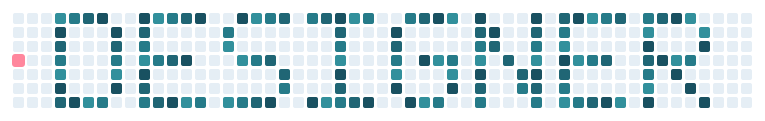

 

  

 

## 01 / Character file

I’m **Shakhzod (이로운)**, a UI/UX designer who brings his own designs to life in code. From Uzbekistan, based in South Korea — building useful products, learning experiences and little playable worlds.

At **[AI G-Payments](https://www.ai-gpayments.com/main/)**, I work on **지페**: QR ordering and payments for guests, with menus, orders, sales and PC POS tools for business owners.

## 02 / Selected work

### Odim

**Developer · UI/UX & design system** 
A recovery app connecting patients, orthopedists and rehabilitation specialists. Separate workspaces, a shared care flow, and support for Uzbek in Latin and Cyrillic, Russian and English.

**[Explore Odim ↗](https://posetrack.pages.dev)**

### Korean with Madie

**Creator · Design & development** 
From Hangul to TOPIK: **8 modules, 99 lessons and 20+ practice games**. An AI tutor, dictionary and translator, with XP, streaks and achievements to keep learning moving.

**[Visit the platform ↗](https://koreanmadie.study/)** · **[Google Play ↗](https://play.google.com/store/apps/details?id=study.koreanmadie.app)**

### GLOW

**In development · Defold & Lua** 
Every match plays a note. Rebuild a town, unlock layers of its soundtrack, and explore **100 levels** with boosters, chests and a shop. Art, sound and music generated through code.

**[Play the web build ↗](https://shakhzodmir.github.io/game/)** · **[View source ↗](https://github.com/Shakhzodmir/game)**

### Smart City Interactive System

**Master’s thesis · UX design & development** 
Bus and metro tracking, traffic, weather, news and culture in one interface. Search, an emergency panel and **four interface languages**, designed for a connected city.

**[Open the live demo ↗](https://shakhzodmir.github.io/smartcity/)** · **[View source ↗](https://github.com/Shakhzodmir/smartcity)**

## 03 / Toolkit

**What I make:** web and mobile interfaces · design systems · brand identities · motion graphics · products that work beyond the mockup.

### 🎨 Design

UI/UX for web and mobile · brand identity and logo · motion graphics · [Behance portfolio](https://www.behance.net/gallery/246919799/Portfolio)

### 🛠️ Code

## 🐍 Designer

<picture>
  <source media="(prefers-color-scheme: dark)" srcset="./assets/designer-snake-dark.svg" />
  
</picture>

## 04 / Activity

 

